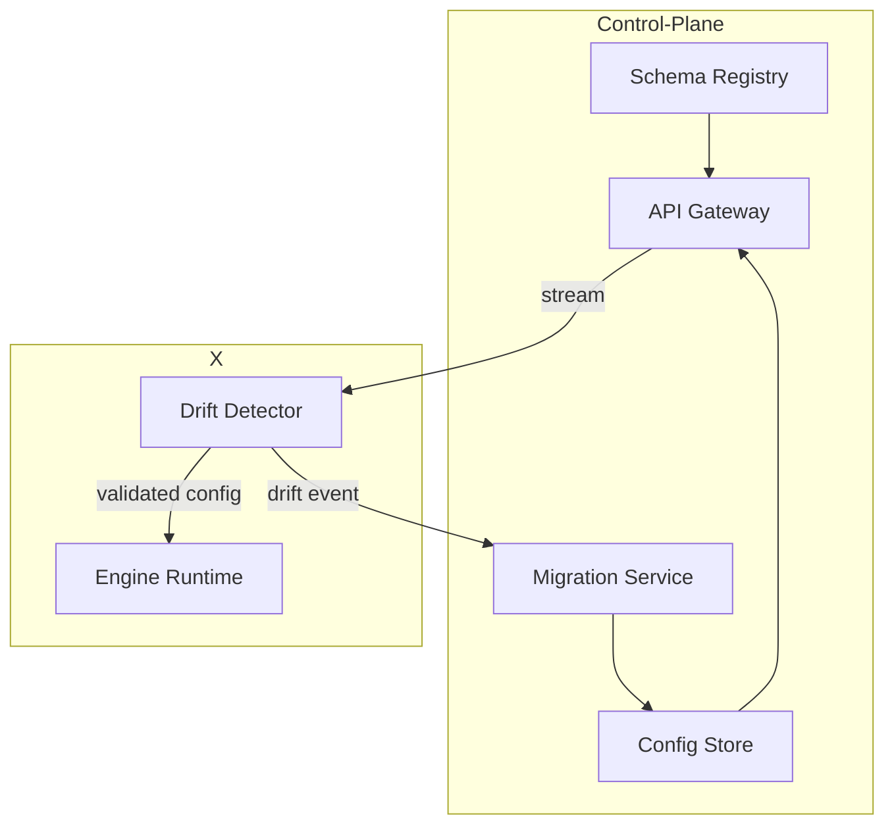

# Versiqii

**Version‑Aware Configuration Management (VACM) for multi‑engine, multi‑region platforms**

> *Shift configurations without drift* — keep every engine instance in every region perfectly in‑sync with the schema version it expects.

---

## Table of Contents

* [Why Versiqii?](#why-versiqii)
* [Key Features](#key-features)
* [Architecture Overview](#architecture-overview)
* [Quick Start](#quick-start)
* [CLI Usage](#cli-usage)
* [API Reference](#api-reference)
* [Configuration Examples](#configuration-examples)
* [Roadmap](#roadmap)
* [Contributing](#contributing)
* [License](#license)

---

## Why Versiqii?

Modern platforms often run **multiple scan engines** (AV, ML, AI, …), each with its own **versioned schema** and **region‑specific deployment**. When an engine upgrades, *configs drift* and scans fail.

**Versiqii** solves this by acting as a **control‑plane service** that:

1. Tracks every engine & schema version across regions.
2. Validates configs against the *right* JSON‑Schema before runtime.
3. Applies on‑the‑fly migrations (WASM) to eliminate drift.
4. Audits every change for easy rollback & compliance.

> Stop copy‑pasting YAML, start shipping versions safely.

---

## Key Features

* **Schema Registry** – draft‑2020‑12 JSON‑Schema with evolution rules (back/forward compatibility flags).
* **Immutable Config Store** – every change = new record, full history & diff.
* **Automatic Drift Detector** – sidecar compares running schema ↔ stored binding.
* **WASM Migration Runtime** – hot‑plug scripts to upgrade/downgrade configs safely.
* **Cross‑Region Mapper** – transforms user scan configs to the destination region’s engine version transparently.
* **Audit & Rollback** – tamper‑proof event log, single‑call rollback.
* **Typed SDKs** – client generators for Rust, Go, Node, Python.

---

## Architecture Overview



* **Control‑Plane** is single‑writer (CockroachDB multi‑region) – global source‑of‑truth.
* **Data‑Plane** sidecar keeps runtime lightweight and fast.

See the full [docs/architecture.md](docs/architecture.md) for sequence diagrams and data models.

---

## Quick Start

### 1. Clone & Build

```bash
git clone https://github.com/your‑org/versiqii.git
cd versiqii
make dev  # spins up Postgres, NATS & the service
```

> Requires **Rust 1.79+**, **Docker 24+**, and **make**.

### 2. Run Hello World

```bash
# Register a schema
target/debug/versiqii schemas add --type scan --version 1.0.0 ./examples/schema_scan_v1.json

# Store a config instance
cat examples/scan_config_v1.json | target/debug/versiqii configs create --type scan --version 1.0.0 -

# Bind it to region "asia-sg" where engine v2.1.3 is deployed
 target/debug/versiqii bindings create \
   --config-id 123e4567-e89b-12d3-a456-426614174000 \
   --region asia-sg \
   --engine-version 2.1.3
```

### 3. Play With the API

Open Swagger UI at [http://localhost:8080/docs](http://localhost:8080/docs) after `make dev`.

---

## CLI Usage

| Command              | Description                          |
| -------------------- | ------------------------------------ |
| `schemas add`        | Register / update a JSON‑Schema      |
| `configs create`     | Create immutable config instance     |
| `bindings create`    | Bind + auto‑migrate to region/engine |
| `drifts list`        | List unmatched configs               |
| `regions set-engine` | Change engine version for a region   |

Run `versiqii --help` for all options.

---

## API Reference

REST + gRPC. Full OpenAPI spec lives in [`spec/openapi.yaml`](spec/openapi.yaml).

```http
PUT /regions/{region}/engine-version
GET /drifts?region=eu-fr&engine_ver=3.0.0
```

---

## Configuration Examples

```jsonc
// scan_config_v1.json
{
  "scan_depth": 3,
  "timeout_ms": 5000,
  "heuristics": {
    "use_yara": true,
    "max_rules": 32
  }
}
```

Run `versiqii validate --file scan_config_v1.json` to check against the active schema.

---

## Roadmap

| Phase     | Highlights                                     | Target  |
| --------- | ---------------------------------------------- | ------- |
| 0.1 (MVP) | CRUD configs, schema validation, single region | 2025‑08 |
| 0.2       | Drift detector, WASM migrator (upgrade)        | 2025‑09 |
| 0.3       | Cross‑region mapper, multi‑region CRDB         | 2025‑10 |
| 0.4       | Downgrade migrator, RBAC, UI dashboard         | 2025‑11 |
| 1.0       | GA, SLA 99.9%, plugin SDK                      | 2026‑Q1 |

---

## Contributing

We ❤️ pull requests! Please read [CONTRIBUTING.md](CONTRIBUTING.md) first.

```bash
git checkout -b feat/awesome
cargo test
cargo fmt --check
```

Open an issue to discuss big changes before coding.

---

## License

Versiqii is licensed under the **Apache License 2.0**. See [LICENSE](LICENSE) for details.

---

> *Made with ☕ & Rust by the Versiqii team – shift safely, ship faster.*
